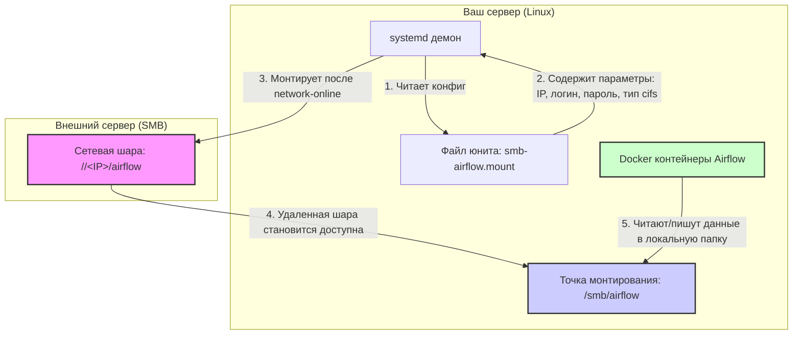
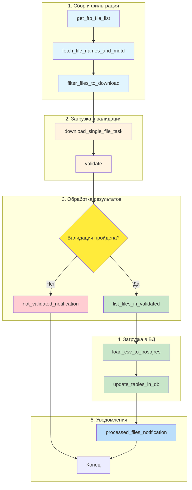

# AIRFLOW PROD — ОРКЕСТРАЦИЯ И ИНТЕГРАЦИЯ ДАННЫХ ВНЕШНЕГО АНАЛИТИЧЕСКОГО ПОДРЯДЧИКА


[](https://www.python.org/)
[](https://airflow.apache.org/)
[](https://www.postgresql.org/)
[](https://www.docker.com/)

Контейнеризированная платформа оркестрации данных на Apache Airflow для автоматической обработки выгрузок фармацевтической аналитики от внешнего подрядчика.

---
## ОПИСАНИЕ СИСТЕМЫ


Этот проект автоматизирует всю цепочку получения данных от внешнего аналитического подрядчика до их загрузки в корпоративное хранилище (DWH):

| ЭТАП | ОПИСАНИЕ | КОМПОНЕНТ |
|------|----------|-----------|
| 1. СБОР ДАННЫХ | Сканирование FTP сервера подрядчика и скачивание новых файлов | Airflow DAG + FTP Hook |
| 2. ВАЛИДАЦИЯ | Проверка данных через внешний ETL-контейнер (etl-toolbox) | Docker Operator |
| 3. ОБРАБОТКА МАСТЕР-ДАННЫХ | Обогащение адресов через Dadata API и создание справочников аптек | PostgreSQL + Dadata API |
| 4. ЗАГРУЗКА В БД | Загрузка очищенных данных в промежуточные таблицы staging | Python Task + SQLAlchemy |
| 5. ПЕРЕНОС В PRODUCTION | Перенос из staging таблиц в финальные fact-таблицы | SQL Operators |
| 6. УВЕДОМЛЕНИЯ | Telegram-отчёты о загрузке, ошибках и проблемах | Telegram Operator |

---
## АРХИТЕКТУРА СИСТЕМЫ



---
## СМЕЖНЫЕ РЕПОЗИТОРИИ

| Проект | Описание | Ссылка |
|--------|----------|--------|
| etl_toolbox | ETL Toolbox для валидации данных | [ETL-TOOLBOX](github.com/khomenkoalx/etl-toolbox) |
| airflow_pharma_orchestration | ORCHESTRATION (этот репозиторий) | [AIRFLOW-PHARMA-ORCHESTRATION](github.com/ahomenko/airflow-pharma-orchestration) |

---

## ТЕХНОЛОГИЧЕСКИЙ СТЕК

| Компонент | Версия | Назначение |
|-----------|--------|------------|
| Airflow | 2.8.4 | Оркестрация пайплайнов |
| Python | 3.11+ | Язык реализации DAG |
| PostgreSQL | 15 | Базы данных хранения |
| Redis | 7 | Broker для Celery |
| Docker | Latest | Контейнеризация задач |
| pandas | 2.1.4 | Обработка табличных данных |
| Dadata SDK | 25.10.0 | Нормализация гео-данных |
| Telegram Bot API | 4.6.0 | Уведомления и алертинг |

---

## СТРУКТУРА ПРОЕКТА

```plain
airflow_prod/
├── airflow/
│   ├── dags/                # Основная логика Airflow
│   │   ├── check_error_types_after_validation.py       # Пайплайн проверки невалидных данных на критические ошибки
│   │   ├── enrich_addresses_in_dim_address.py          # Пайплайн обогащения справочника адресов
│   │   ├── main_pharmacy_data_pipeline.py              # Основной пайплайн для загрузки данных фактов
│   │   ├── process_pharmacies_and_addresses.py     # Пайплайн формирования справочников аптек и адресов
│   │   └── utils/                   # Вспомогательные функции
│   │       ├── ftp_utils.py         # Работа с FTP (сканирование, загрузка)
│   │       └── telegram_utils.py    # Форматирование сообщений для Telegram
│   ├── logs/                # Логи задач Airflow
│   └── plugins/             # Кастомные плагины
├── .env                     # Переменные окружения
├── .env.example             # Шаблон переменных
├── Dockerfile               # Кастомный образ Airflow
├── docker-compose.init.yml  # Первичная инициализация инфраструктуры
├── docker-compose.local.yml # Локальная разработка (SequentialExecutor)
├── docker-compose.prod.yml  # Продакшн (CeleryExecutor)
├── requirements.txt         # Зависимости проекта
└── readme.md
```
---
## БЫСТРЫЙ СТАРТ

### 1. НАСТРОЙКА СЕРВЕРА (выполняется ОДИН РАЗ на продакшен сервере)

#### МОНТИРОВАНИЕ СЕТЕВОЙ ШАРЫ

Этот шаг обязателен для доступа к данным между Docker-контейнером и хостом:

```bash
sudo mkdir -p /smb/airflow

sudo nano /etc/systemd/system/smb-airflow.mount
```

Описание юнита:  
```text
[Unit]
Description=Mount Airflow Share from Windows SMB
After=network-online.target
Wants=network-online.target

[Mount]
What=//<IP_АДРЕС_ШАРЫ>/airflow
Where=/smb/airflow
Type=cifs
Options=username=<ЛОГИН>,password=<ПАРОЛЬ>,uid=1000,gid=1000,forceuid,forcegid,nodfs,iocharset=utf8,_netdev
TimeoutSec=30

[Install]
WantedBy=multi-user.target
```

Обновление демона:  
```bash
sudo systemctl daemon-reload
sudo systemctl enable --now smb-airflow.mount
sudo systemctl status smb-airflow.mount
```

Проверка:
```bash
ls -la /smb/airflow
```

#### ИЗМЕНЕНИЕ ПРАВ DOCKER-SOCKET

```bash
sudo chmod a+rw /var/run/docker.sock
```

### 2. КЛОНИРОВАНИЕ И ПОДГОТОВКА  

```bash
git clone https://github.com/khomenkoalx/airflow_pharma_orchestration
cd airflow_pharma_orchestration
```

#### Создание виртуального окружения (опционально)
```bash
python -m venv venv
source venv/bin/activate  # Linux/macOS
venv\Scripts\activate     # Windows

pip install -r requirements.txt
```

### 3. НАСТРОЙКА ПЕРЕМЕННЫХ ОКРУЖЕНИЯ
```bash 
cp .env.example .env
```

Отредактируйте следующие переменные:
```plain
AIRFLOW_IMAGE_NAME=apache/airflow:2.8.4-python3.11
AIRFLOW_UID=1000

POSTGRES_USER=airflow
POSTGRES_PASSWORD=db_password
POSTGRES_DB=airflow

REDIS_PASSWORD=redis_password

AIRFLOW__CORE__DEFAULT_TIMEZONE=UTC
AIRFLOW__CORE__EXECUTOR=CeleryExecutor
AIRFLOW__CORE__LOAD_EXAMPLES=False
```

---
## НАСТРОЙКА CONNECTIONS И VARIABLES В AIRFLOW UI


### Шаг 1: Откройте интерфейс

http://localhost:8080 ИЛИ IP вашего сервера  
Логин: admin  
Пароль: admin_password (или из переменной .env)  

--- 
### Шаг 2: Создайте Connections

Перейдите в Admin → Connections → Создайте новые:

- postgres_conn
- ftp_conn
- telegram_notifications_conn
- docker_registry


Пример Connection postgres_conn:
- Host: 192.168.XXX.XXX
- Login: buser
- Password: ***********
- Extra: {} (можно указать schema или другие параметры)

--- 
### Шаг 3: Создайте Variables

Перейдите в Admin → Variables → Добавить новую переменную:

- DADATA_TOKEN
- DADATA_SECRET
- DB_CONNECTION_STRING_SECRET
- EMAIL_PASSWORD
- EMAIL_RECEIVER
- EMAIL_SENDER
- SMTP_HOST
- SMTP_PORT


---
## ВАРИАНТЫ РАЗВЁРТЫВАНИЯ


### 1. ДЛЯ ИНИЦИАЛИЗАЦИИ (разовая настройка инфраструктуры)

```bash
docker compose -f docker-compose.init.yml up -d
```

Создаёт:
- База данных PostgreSQL
- Redis брокер
- Первый пользователь Airflow
- Анимации миграций БД

### 2. ПРОДАКШН (CeleryWorker, постоянный режим работы)

```bash
docker compose -f docker-compose.prod.yml up -d
```

Запускает:
- Webserver (8080 порт)
- Scheduler
- Celery Worker
- PostgreSQL
- Redis

### 3. ЛОКАЛЬНАЯ РАЗРАБОТКА (SequentialExecutor, облегченная версия)
```bash
docker compose -f docker-compose.local.yml up -d
```

Особенности:
- SequentialExecutor вместо Celery
- SQLite база данных внутри контейнера
- Порт 8081 (не конфликтует с продакшеном)
- Удобен для тестирования DAG без полной инфраструктуры

---
## ОПИСАНИЕ DAG (PIPELINES)

------------------------------------------------------------------------------
### main_pharmacy_data_pipeline — Главный пайплайн загрузки данных

**Расписание:** Ежедневно в 01:15 UTC (`15 1 */1 * *`)

**Цель:** Загрузка, валидация и обработка всех выгрузок с FTP подрядчика

---

### Схема выполнения



| № | Задача ID | Описание |
|---|-----------|----------|
| 1 | get_ftp_file_list | Сбор списка файлов на FTP с MDTM метками |
| 2 | fetch_file_names_and_mdtd | Получение истории загруженных файлов из БД |
| 3 | filter_files_to_download | Фильтрация изменений по MDTM и исключение дублей |
| 4 | download_single_file_task | Скачивание файла с FTP в локальное хранилище |
| 5 | validate | Запуск контейнера etl-toolbox для валидации |
| 6 | list_files_in_validated | Определение целевых таблиц для каждого файла |
| 7 | load_csv_to_postgres | Загрузка валидных данных в staging таблицы PostgreSQL |
| 8 | update_tables_in_db | Перенос в факт-таблицы (DELETE + INSERT pattern) |
| 9 | processed_files_notification | Telegram отчёт о успешно обработанных файлах |
| 10 | not_validated_notification | Telegram отчёт о файлах, не прошедших валидацию |


---
## process_pharmacies_and_addresses (мастер-данные)  
Расписание: Ежедневно в 02:30 UTC (30 2 */1 * *)  
ЦЕЛЬ: Обогащение справочника аптек через Dadata API, работа с ФИАС-кодами

ЗАДАЧИ:

| № | Задача ID | Описание |
|---|-----------|----------|
| 1 | download_address_csv_task | Скачивание файла АДРЕСА.csv с FTP |
| 2 | get_ids_fias_and_load_db | Извлечение уникальных FIAS-кодов и запись в БД |
| 3 | get_dim_pharmacy_and_load | Парсинг аптечных данных и запись в staging |
| 4 | update_dim_pharmacy | AGGREGATE в dim_pharmacy с ON CONFLICT паттерном |
| 5 | move_file_task | Перемещение обработанного файла в архив |

---
### Утилиты проекта

#### Модуль FTP (`airflow/dags/utils/ftp_utils.py`)

| Функция | Описание |
|---------|----------|
| `get_current_files_on_ftp()` | Рекурсивный обход FTP каталога с сбором файлов и их MDTM меток |
| `download_file_from_ftp()` | Скачивание файла с FTP сервера с сохранением в локальную файловую систему |

#### Модуль Telegram (`airflow/dags/utils/telegram_utils.py`)

| Функция | Описание |
|---------|----------|
| `format_downloaded_files()` | Форматирование списка новых скачанных файлов для отправки в Telegram |
| `format_not_validated_files()` | Форматирование списка файлов, не прошедших валидацию, с описанием ошибок |
| `on_failure_telegram()` | Автоматическое уведомление о падении задачи DAG через Telegram |


---
### ОСОБЕННОСТИ ВАЛИДАЦИИ

Валидация выполняется через внешний Docker-контейнер etl-toolbox:latest


---
### МАРШРУТИЗАЦИЯ ДАННЫХ (FILE -> TABLE)


| Исходный файл        | Таблица staging       | Описание                                   |
|----------------------|-----------------------|--------------------------------------------|
| ЗАКУПКИ              | stg_fct_purchase      | Закупки аптеками у дистрибьюторов          |
| ПРОДАЖИ              | stg_fct_sale_third    | Третичные продажи (аптекам физлица)        |
| ПРОДАЖИ ДБ           | stg_fct_sale_second   | Вторичные продажи (сетям от дистрибьюторов)|
| ВОЗВРАТЫ ДБ          | stg_fct_sale_second   | Возвраты от сетей на склады дистрибьюторов|
| ОСТАТКИ              | stg_fct_rest          | Остатки в аптеках сетей                    |
| ОСТАТКИ ДБ           | stg_fct_rest          | Остатки на складах дистрибьюторов          |
| ТРАНЗИТ ДБ           | stg_fct_rest          | Товар в пути до склада дистрибьютора       |

---
### ОТЧЁТЫ И МЕТРИКИ


После обработки система выводит статистику в Telegram:

✅ ТЕКУЩИЕ ФАЙЛЫ

✅ *2026-03-04 с FTP-сервера скачены новые файлы:*

• `ЗАКУПКИ_январь_20251201_20260202204427.csv`  
• `ПРОДАЖИ_февраль_20251201_20260202204427.csv`  
• `ОСТАТКИ_март_20251201_20260202204427.csv`  
